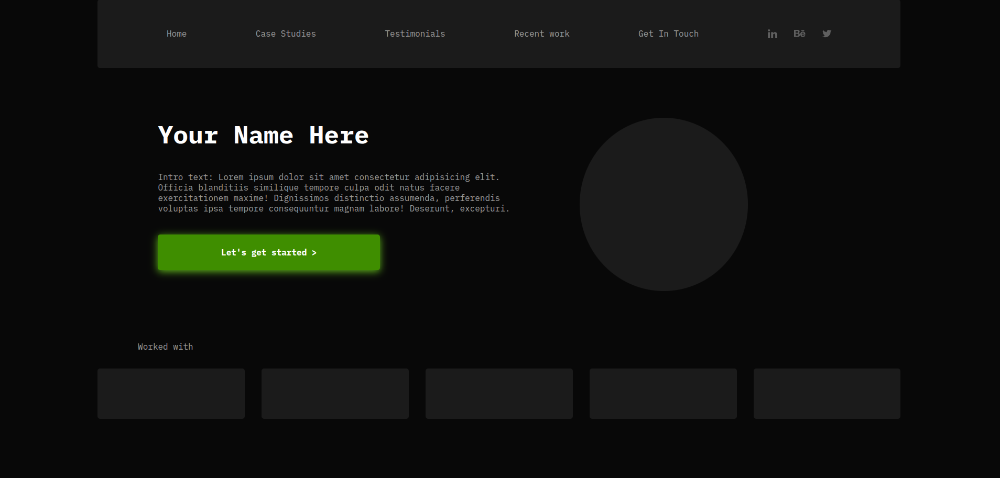

# personal-portfolio-template

# Design by

- [Shah](https://www.figma.com/community/file/1116316830579955404)

# Link

- [Live-preview](https://azanra.github.io/personal-portfolio-template/)

# About

The project focus on recreating static page with the use of grid AND flexbox
based on this project i can use grid whenever i want the layout to shape the
position of the item. and for flexbox is used whenever i want the item to shape
the layout. it's not as simple as grid is for layout and flexbox is for smaller
component. even though the usage is technically correct because grid is for two
dimensional (grid and column) while flexbox is for one dimensional (grid or column)
, Grid can also be used for one dimensional and flex can also be used for "two dimensional"
with the help of flex-wrap

# Review

This layout is almost the same as the previous project, i should look for more complex layout
to practice with grid and flex.

# Screenshot

